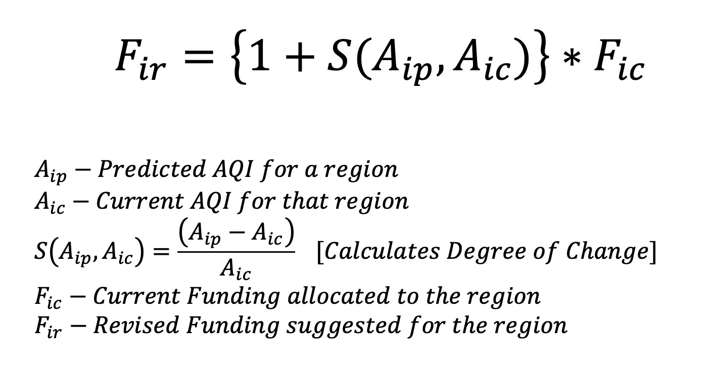

# Project Genesis

### A state-of-the-art framework, designed to be primarily used by the Government, or the Headquarters of a large firm or industry.

> [!TIP]
> Optional information to help a user be more successful.
> This project helps to optimize grants and funding to various initiatives and NGOs in various cities, depending on the following factors
> - Current AQI
> - Forecasted AQI
> - Current budget allocated to the initiative

> [!NOTE]  
> View the Frontend using [This Link]() (WIP). This is included as a submodule here.

## Methodology
This software makes use of multiple efficient Machine Learning algorithms to forecast AQI for many cities at the same time.
- LSTM for AQI Forecasting
- Logistic Regression for predicting particulate matter and pollutant concentrations

## Funding Recalculation



## Tech Stack
- ### Frontend
    - React
    - Vite
- ### Backend
    - Pytorch
    - FastAPI

For more details, refer to [Requirements](requirements.txt)

## Installation
- Clone the repository using
  - ```shell
    git clone https://github.com/Mahasvan/pragyan-backend
    ```
- Install dependencies
  - Pytorch
    - ```shell
      pip3 install --pre torch torchvision torchaudio --index-url https://download.pytorch.org/whl/nightly/cpupip install torch
      ```
  - Install other requirements
    - ```shell
      pip3 install -r requirements.txt
      ```
- Run the backend
  - ```shell
    uvicorn main:app --reload
    ```
